## 📌 Projeto
Projeto _Recipes App_ (Aplicativo de Receitas), realizado em grupo durante o Curso de Desenvolvimento Web na Trybe.

#### 👩‍💻 Tecnologias e Ferramentas utilizadas:
- HTML
- CSS
- JavaScript
- React
  - Context API
  - Hooks

#### 📸 Layout:
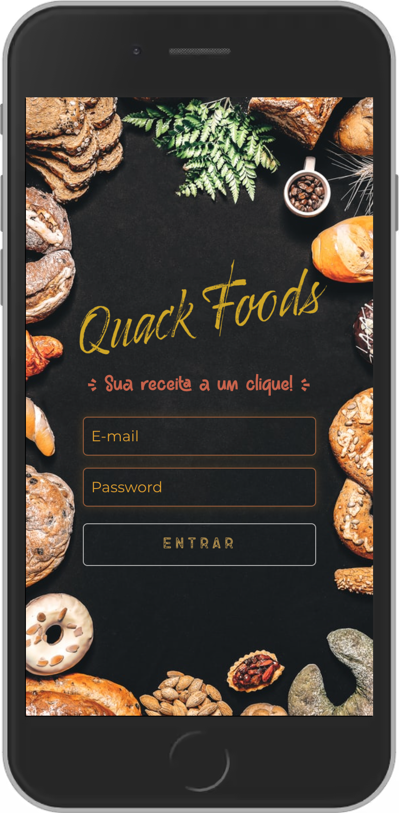
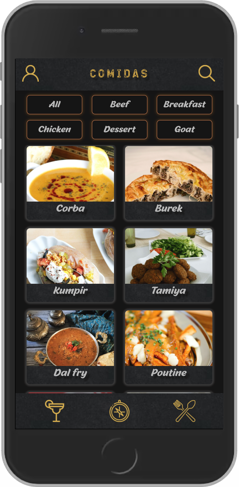
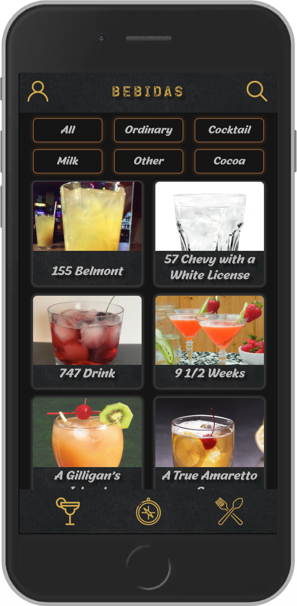
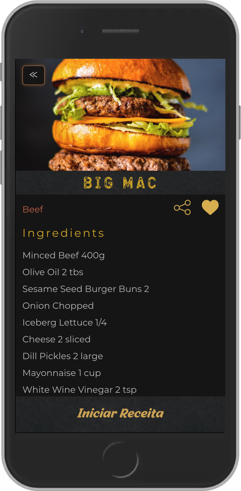
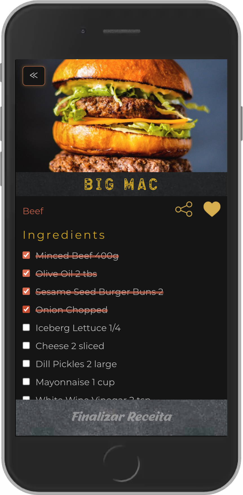
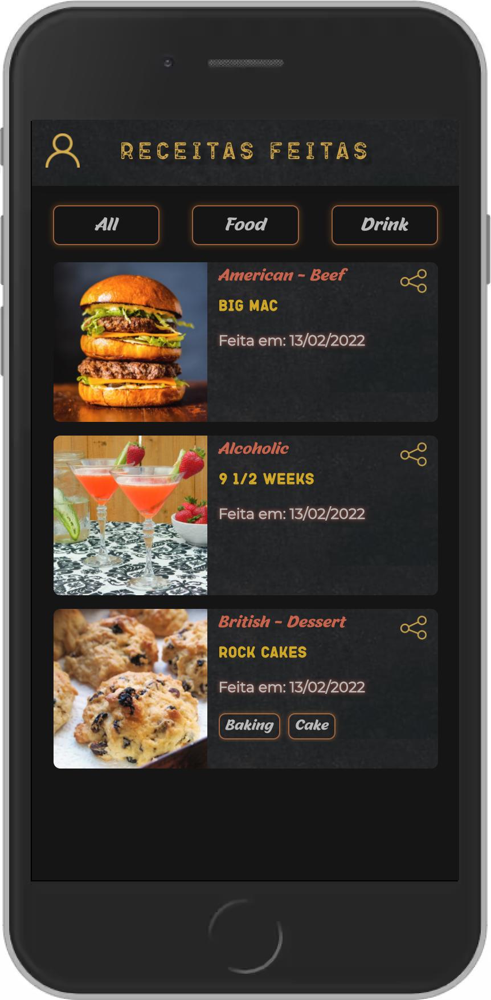
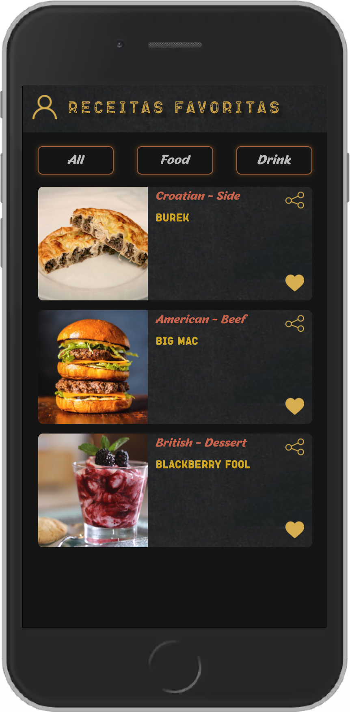
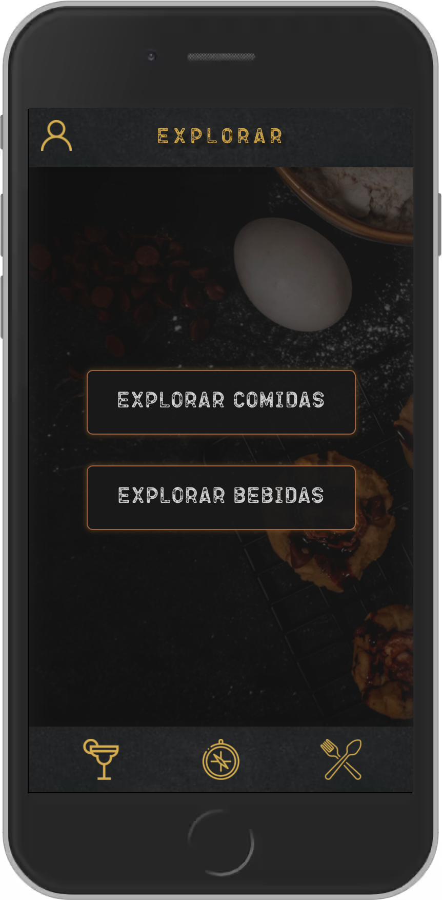
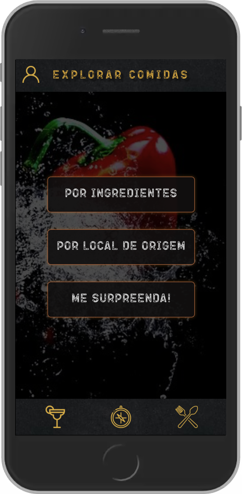
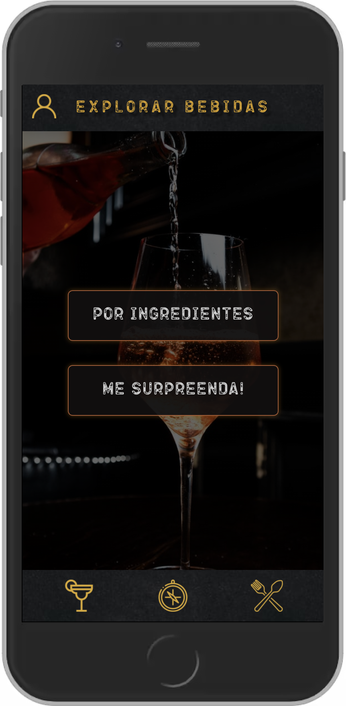
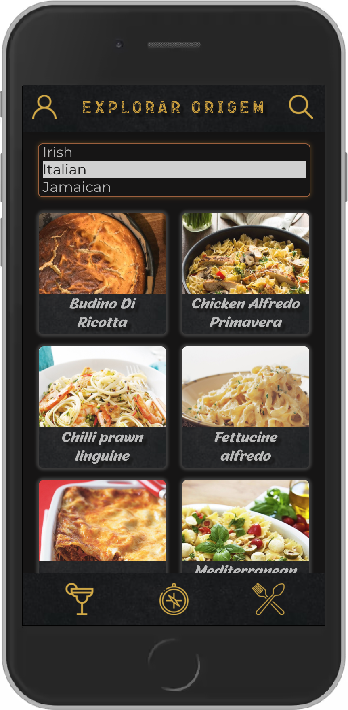
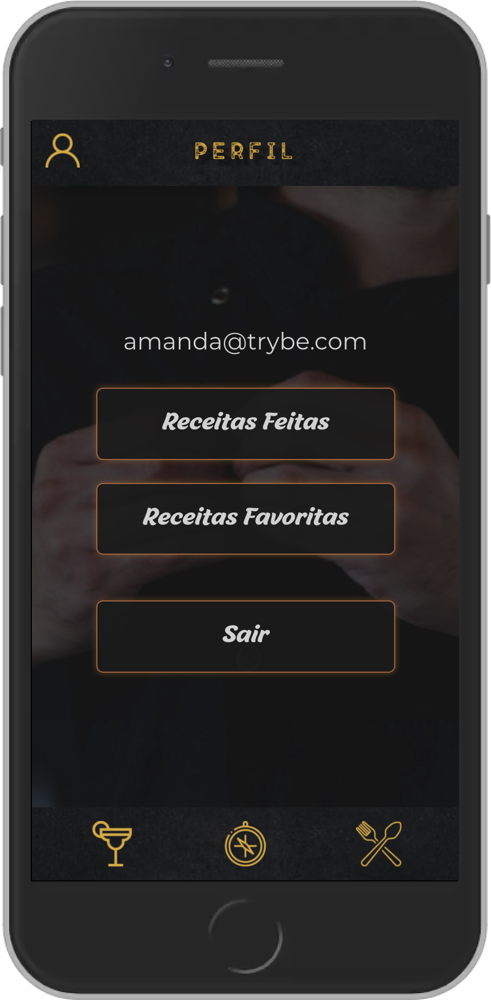

